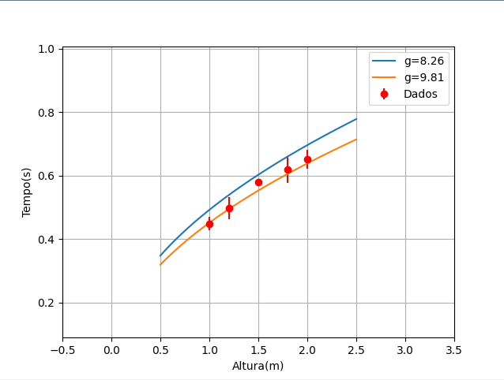

# AnaliseDeDados_Gravitacao2

* No script **trabalhofinal.py** lemos os dados do arquivo **reduzido.txt** e usando o resultado do script **ajuste.py** descobrimos o valor G(aceleração gravitacional) experimental do nosso projeto.

* No script **plotgraf.py** utilizamos o valor de G experimental descoberto para plotar uma curva tempo com esse G e compara-la com a curva tempo teorica onde o g=9.81m/s^2 que tambem foi plotada, e tambem plotamos os tempos medios achados com suas barras de erro para referência.

## Resultado:

